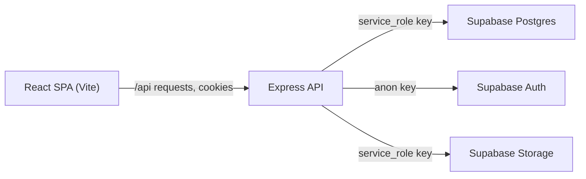

# NovaMarket

A full-stack e-commerce storefront: a React single-page app, an Express REST
API, and Supabase (Postgres + Auth + Storage) as the data layer.

- **Frontend** — React 19, Vite, React Router, Tailwind CSS v4 (in `src/`).
- **Backend** — Express 4 REST API (`server/`). The React app talks only to
  this API; the API holds the Supabase **service_role** key and is the single
  authorization layer.
- **Database / Auth / Storage** — Supabase.

This README is the single source of truth for running, configuring and
deploying the project. `server/README.md` is the backend API reference.
`BACKEND_PLAN.md` is the original design document and is kept for history only.

## Contents

1. [Architecture](#architecture)
2. [Repository layout](#repository-layout)
3. [Prerequisites](#prerequisites)
4. [Local setup](#local-setup)
5. [Environment variables](#environment-variables)
6. [Database and migrations](#database-and-migrations)
7. [Payments](#payments)
8. [Deployment](#deployment)
9. [Production security requirements](#production-security-requirements)
10. [Development accounts](#development-accounts)
11. [Scripts](#scripts)
12. [API reference](#api-reference)

## Architecture



- The browser authenticates with the API, which sets **HttpOnly** session
  cookies. JavaScript never reads the access or refresh token.
- Mutating requests that use cookies must also send a double-submit CSRF header
  (`X-CSRF-Token`), read from the non-HttpOnly `nm_csrf` cookie.
- In development, Vite proxies `/api/*` to `http://localhost:4000` and strips
  the `/api` prefix, so backend routes are served at the root (for example
  `/auth/login`).

## Repository layout

```
/
├── src/                  React SPA (pages, components, context, API client)
│   └── lib/api.js        fetch wrapper: cookies, CSRF, silent token refresh
├── server/               Express API (its own package.json)
│   ├── db/               SQL files (schema, RPC, seed, one-paste setup)
│   ├── scripts/          seed-users.js (dev role accounts)
│   └── src/              config, middleware, routes, controllers, services
├── BACKEND_PLAN.md       original design document (historical)
└── README.md             this file
```

## Prerequisites

- **Node.js 20+** (the server declares `engines.node >= 20`).
- A **Supabase** project (the free tier is enough).
- Optional: a payment-provider account — see [Payments](#payments). There is no
  live payment gateway wired in yet.

## Local setup

### 1. Clone the repository

```bash
git clone https://github.com/koustubhchouhan/e_commerce.git
cd e_commerce
```

### 2. Create the Supabase project and copy the keys

Create a project at supabase.com. From **Project Settings -> API** copy:

- Project URL (`SUPABASE_URL`)
- `anon public` key (`SUPABASE_ANON_KEY`)
- `service_role` key (`SUPABASE_SERVICE_ROLE_KEY`) — secret, server only

### 3. Apply the database

Open the Supabase **SQL Editor**, create a new query, paste the entire contents
of `server/db/setup_all.sql` and **Run**. That single file applies, in order:

1. `schema.sql` — enums, tables, the `handle_new_user` trigger, indexes, RLS.
2. `create_order.sql` — the atomic server-authoritative checkout function.
3. `seed.sql` — starter categories and the two default hero slides.

Every statement is idempotent (`IF NOT EXISTS`, guarded enums,
`CREATE OR REPLACE`, `ON CONFLICT DO NOTHING`), so it is safe to re-run.

Prefer to run the pieces yourself? Execute `server/db/schema.sql`, then
`server/db/create_order.sql`, then `server/db/seed.sql`, in that order.

### 4. Create the Storage bucket

In the Supabase dashboard go to **Storage -> New bucket**:

- Name: `product-images`
- Public bucket: **enabled**

The API uploads product images, avatars and hero-slide images into this one
bucket using the service_role key. The browser only reads the resulting public
URLs.

### 5. Configure environment variables

Backend:

```bash
cd server
cp .env.example .env
```

Edit `server/.env` and fill in `SUPABASE_URL`, `SUPABASE_ANON_KEY` and
`SUPABASE_SERVICE_ROLE_KEY`. The defaults for `PORT`, `CLIENT_ORIGIN` and
`COOKIE_SAMESITE` are correct for local development.

Frontend:

```bash
cd ..
cp .env.example .env
```

For local development **leave `VITE_API_URL` empty**. The app then calls `/api`
and Vite's dev proxy forwards to the backend, which keeps the session cookies
first-party. Google sign-in is optional; see the comments in `.env.example`.

### 6. Install dependencies

```bash
# install both the frontend and the API
npm install
npm install --prefix server
```

### 7. Seed development accounts (optional)

```bash
npm run seed:users --prefix server
```

Creates one customer, one seller and one admin. See
[Development accounts](#development-accounts). **Never run this against a
production project.**

### 8. Run both services

Use two terminals:

```bash
# terminal 1 — API on http://localhost:4000
npm run dev --prefix server
```

```bash
# terminal 2 — SPA on http://localhost:5173
npm run dev
```

Open http://localhost:5173. The SPA reaches the API through the `/api` proxy.

### 9. Smoke-test the API

```bash
# health check
curl http://localhost:4000/health

# public catalog
curl http://localhost:4000/products

# register (also sets session cookies)
curl -i -X POST http://localhost:4000/auth/register \
  -H "Content-Type: application/json" \
  -d '{"email":"me@example.com","password":"supersecret","fullName":"Test User"}'
```

## Environment variables

### Frontend (`/.env`, Vite — exposed to the browser)

| Variable | Required | Purpose |
| --- | --- | --- |
| `VITE_API_URL` | No | Absolute API base URL. Leave empty in dev to use the Vite `/api` proxy. Set it when the SPA is served from a different origin. |
| `VITE_SUPABASE_URL` | No | Supabase project URL, only needed for Google sign-in. |
| `VITE_SUPABASE_ANON_KEY` | No | Supabase `anon` key, only needed for Google sign-in. The anon key is public by design. |

Anything prefixed with `VITE_` is embedded in the built JavaScript. **Never**
put the `service_role` key or any other secret in a `VITE_` variable.

### Backend (`server/.env`, Node — never exposed)

| Variable | Required | Default | Purpose |
| --- | --- | --- | --- |
| `PORT` | No | `4000` | API listen port. |
| `CLIENT_ORIGIN` | No | `http://localhost:5173` | Exact origin allowed by CORS. Set to the deployed SPA origin in production. |
| `NODE_ENV` | No | `development` | `production` switches cookies to `Secure` and enables stricter behavior. |
| `COOKIE_SAMESITE` | No | `lax` | `lax` for same-site SPA + API. `none` only when the API is on a different site than the SPA (requires HTTPS). |
| `COOKIE_DOMAIN` | No | unset | Optional parent domain for cookies, for example `.example.com`. |
| `SUPABASE_URL` | **Yes** | — | Supabase project URL. |
| `SUPABASE_ANON_KEY` | **Yes** | — | Used only for auth sign-in / token refresh. |
| `SUPABASE_SERVICE_ROLE_KEY` | **Yes** | — | Full database access, bypasses RLS. Server only. |

The server fails fast at boot if any required Supabase variable is missing.

## Database and migrations

There is no migration tool. Schema changes are applied by running SQL in the
Supabase SQL Editor.

- `server/db/setup_all.sql` — the whole schema in one paste. **Use this for a
  fresh project.**
- `server/db/schema.sql` — tables, enums, triggers, indexes, RLS.
- `server/db/create_order.sql` — the checkout function.
- `server/db/seed.sql` — seed categories and default hero slides.

Guidelines when changing the schema:

1. Add new statements to `schema.sql` and keep `setup_all.sql` in sync (it is a
   concatenation of the three files).
2. Make every change re-runnable: `create table if not exists`, `alter table
   ... add column if not exists`, `create or replace`, guarded enum creation.
3. Run the changed SQL in the SQL Editor for existing environments.
4. If Supabase reports a stale schema cache, run this in the SQL Editor:

   ```sql
   notify pgrst, 'reload schema';
   ```

### Tables

`profiles`, `stores`, `seller_applications`, `categories`, `products`,
`product_images`, `orders`, `order_items`, `reviews`, `contact_messages`,
`hero_slides`.

Row Level Security is **enabled with policies** on every table. The Express API
still uses the `service_role` key (which bypasses RLS) as the primary
authorization layer, so the policies are a second layer: they define what the
`anon`/`authenticated` keys may read and write if they ever query Postgres
directly. Reads cover the public catalog and a caller's own data; writes are
limited to user-authored content (reviews, contact messages, seller
applications). Products, stores, orders, categories and hero slides are
write-denied to those keys on purpose, so a seller cannot self-approve a
listing or change their own role. The policies live at the end of
`server/db/schema.sql`. A `security_invoker` view, `reviews_public`, adds the
author's display name via a `display_name()` helper so the public review list
can read under RLS without exposing the `profiles` table.

## Payments

**There is no live payment gateway integration.** The current checkout is a
placeholder that models the flow without charging anyone:

1. The SPA collects card fields for layout only — they are not sent to the API
   and no card data is stored.
2. `POST /orders` calls the `create_order` Postgres function, which creates the
   order with status `pending`, computes every price from the `products` table
   (the client never sends a price), locks product rows `FOR UPDATE`, decrements
   stock and rejects mixed-store carts. The whole call is one transaction.
3. An order can then be cancelled by the customer before it ships, or advanced
   in fulfilment by a seller (`PATCH /seller/orders/:id/status`) or an admin
   (`PATCH /admin/orders/:id/status`). Cancelling restores stock. The allowed
   transitions are `pending -> shipped`, `paid -> shipped`,
   `shipped -> delivered`, and `cancelled` from `pending`/`paid`. Only
   `shipped`, `delivered` and `cancelled` are accepted by these endpoints.

The `paid` status exists in the order-status enum but **nothing in the API sets
it** — it is reserved for a payment gateway webhook.


### Adding a real gateway

The status enum and the `pending` order already give you the seams. A typical
integration (for example Razorpay or Stripe) needs:

1. A server endpoint that creates a provider order/intent for an existing
   `pending` order and returns the provider's public key + order id to the SPA.
2. A signed webhook endpoint (verify the signature before trusting the body)
   that marks the order `paid` on success. Webhooks must be called by the
   provider, so they cannot go through the cookie-based CSRF flow — treat the
   signature as the authentication.
3. Provider secrets stored as server environment variables only. Never in a
   `VITE_` variable and never in the repository.
4. Idempotency: record the provider payment id on the order and ignore repeat
   webhook deliveries.

## Deployment

The frontend and the API deploy separately.

### Backend (Render, Railway, Fly.io, ...)

- Root directory: `server`.
- Build command: `npm install`.
- Start command: `npm start` (runs `node src/index.js`).
- Set all backend environment variables, including `NODE_ENV=production`,
  `CLIENT_ORIGIN=https://<your-spa-origin>` and the three Supabase keys.
- Use a Node 20+ runtime.

### Frontend (Vercel, Netlify, ...)

- Build command: `npm run build`. Output directory: `dist`.
- Point the SPA at the API in one of two ways:

  **Option A — reverse proxy (recommended).** Leave `VITE_API_URL` empty and
  add a rewrite that proxies `/api/*` to the backend while stripping the
  `/api` prefix, so the session cookies stay first-party. For Vercel, in
  `vercel.json`:

  ```json
  {
    "rewrites": [
      { "source": "/api/:path*", "destination": "https://<api-host>/:path*" }
    ]
  }
  ```

  **Option B — direct cross-site calls.** Set `VITE_API_URL` to the API origin.
  Because the SPA and API are now on different sites, the API must run with
  `NODE_ENV=production` and `COOKIE_SAMESITE=none` (which requires HTTPS), and
  `CLIENT_ORIGIN` must be the exact SPA origin. Some browsers block
  third-party cookies, so Option A is preferred.

### Database

Apply `server/db/setup_all.sql` to the production Supabase project and create
the public `product-images` bucket. Do **not** run `seed.sql`'s hero slides or
`npm run seed:users` blindly in production; the seed only inserts when the
tables are empty, but review it first.

## Production security requirements

Treat this as a checklist before going live.

- **Never expose `SUPABASE_SERVICE_ROLE_KEY`.** It bypasses RLS. It belongs
  only in the API's server-side environment. Do not put it in a `VITE_`
  variable, the SPA, a mobile app, or version control.
- **HTTPS everywhere.** Required for `Secure` cookies and for
  `COOKIE_SAMESITE=none`.
- **Set `NODE_ENV=production`** so session cookies are issued with `Secure`.
- **Pin `CLIENT_ORIGIN`** to the exact SPA origin. CORS is configured with
  credentials, so a wildcard or a broad origin would allow cross-site
  authenticated requests.
- **Keep CSRF protection on.** Cookie-authenticated state changes require a
  matching `X-CSRF-Token` header. Bearer-token clients are exempt by design.
- **Keep the Helmet CSP** (or tighten it) and serve the SPA with an equivalent
  `Content-Security-Policy` header for the HTML document.
- **Keep RLS policies in place** on every table as defense in depth. They
  constrain the `anon`/`authenticated` keys; the server's `service_role` key
  bypasses them by design, so the API remains the primary authorization layer.
- **Do not run dev seeding in production.** `npm run seed:users` creates
  accounts with a known password and the login page exposes quick-login
  buttons gated behind `import.meta.env.DEV`, which Vite strips from production
  builds.
- **Rotate secrets** if a key was ever committed or shared, and manage them
  through your host's secret store.
- **Review the `product-images` bucket.** It is intentionally public-read for
  hot-linking. Uploads must go through the API only; the browser must never
  hold a Supabase write credential.
- **Add rate limiting** on the public auth, contact and review endpoints before
  exposing the API to the open internet. The application does not ship one.
- **Validate payment webhooks by signature** and store provider secrets
  server-side only.
- **Back up the database** and enable Supabase point-in-time recovery on paid
  plans for anything you care about.

## Development accounts

`npm run seed:users --prefix server` creates (or resets) three pre-confirmed
accounts, all with the password `password123`:

| Email | Role |
| --- | --- |
| `customer@novamarket.test` | customer |
| `seller@novamarket.test` | seller |
| `admin@novamarket.test` | admin |

In dev builds the login page also shows **Dev quick login** buttons for these
accounts; they are stripped from production builds. To promote any other
account, edit its `role` in **Table Editor -> profiles**.

## Scripts

Frontend (repository root):

| Command | Description |
| --- | --- |
| `npm run dev` | Start the Vite dev server (http://localhost:5173). |
| `npm run build` | Production build to `dist/`. |
| `npm run preview` | Preview the production build locally. |
| `npm run lint` | Run oxlint. |

Backend (`server/`):

| Command | Description |
| --- | --- |
| `npm run dev` | Start the API with `node --watch` (http://localhost:4000). |
| `npm start` | Start the API once (production). |
| `npm run seed:users` | Create/reset the three dev accounts. |

## API reference

See `server/README.md` for the full endpoint list, the auth and cookie model,
and backend-specific setup details.
